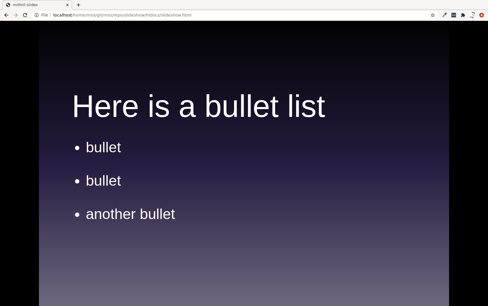

Mithril HTML Slideshow
============================

[](https://badge.fury.io/js/html-slideshow)
[](https://gitter.im/mosbth/html-slideshow?utm_source=badge&utm_medium=badge&utm_campaign=pr-badge&utm_content=badge)

[](https://travis-ci.com/mosbth/html-slideshow)

This enables you to build slideshows using HTML and Markdown in a single HTML page.

You write all your slides in one html-file. Each slide is written in its own `<script>` tag.

Here is how a markdown slide can be created.

```
<script data-role="slide" data-markdown type="text/html">
# Here is a bullet list

* bullet
* bullet
* another bullet

</script>
```

When you open the html file in a browser, each `<script>` tag is rendered to be a slide.

It can look like this.




Try it out
----------------------------

This repo contains some sample presentations, published onto GitHub pages, that you can review to get an understanding on how it works.

| Presentation             | Explained                                     |
|--------------------------|-----------------------------------------------|
| [slideshow-markdown.html](https://mosbth.github.io/mithril-slideshow/htdocs/slideshow.html) | Slides created by writing markdown. |


Keyboard shortcuts
----------------------------

Shortcuts for navigating slides are listed below

| Action                    | Shortcut                                      |
|---------------------------| ----------------------------------------------|
| Next slide                | Right Arrow, Down Arrow, Space bar or Return  |
| Previous slide            | Left Arrow, Up Arrow or Backspace             |
| Enter presentation mode   | f (as in fullscreen)                          |
| 1, 2, 3, 4, 5             | Change theme                                  |
| Quit presentation mode    | Period                                        |


Getting started
----------------------------

1. Open the file `slideshow.html` in your browser to see the sample slideshow.

2. To add or edit slides, make changes to the `slideshow.html` file and reload your browser.

3. To make a new slideshow, copy `slideshow.html` to another file and edit it.


How to write a slide
----------------------------

Create the slides with pure HTML and wrap them in a `<script>` element. Like the following three slides.

```html
<script data-role="slide" type="text/html">
<h1>Lorem Ipsum Dolor</h1>
<h3>Duis aute irure</h3>

</script>

<script data-role="slide" type="text/html">
<h1>Lorem Ipsum Dolor</h1>
</script>

<script data-role="slide" type="text/html">
<h1>Lorem Ipsum Dolor</h1>
<ul>
    <li>Consectetur adipisicing elit, sed do eiusmod tempor incididunt ut labore et dolore magna aliqua</li>
    <li>Ut enim ad minim veniam</li>
    <li>Duis aute irure dolor in reprehenderit in voluptate velit esse cillum dolore eu fugiat nulla pariatur</li>
</ul>
</script>
```


How to change the theme
----------------------------

There are three default themes. You can switch between the themes using keys 1 to 5.

You can edit the stylesheet `css/mithril-slideshow.less` to customize your own theme.

Use `make` to generate CSS from the LESS code.
```
$ make build
```


How to change style for individual slides
----------------------------

You can add a class to each slide, like `class="slide-b"` below.

```html
<script data-role="slide" class="slide-b" type="text/html">
<h1>Lorem Ipsum Dolor</h1>
<p>Duis aute irure</p>
</script>
```

This makes it possible to individually style each slide.


How to add syntax highlighting on source code
----------------------------

Syntax highlighting is enabled by default by using [`highlight.js`](https://highlightjs.org/). But you need to separate the code from the slide since creating a slide with source code is a two step rocket.

First create the slide with a placeholder for the code.

```html
<script data-role="slide" type="text/html">
<pre data-code="hello"></pre>
</script>
```

Then create a script element holding the code.

```html
<script id="hello" data-role="code" data-language="php" type="text/html">
<?php
echo "Hello World";
</script>
```

Done. When the slide is created, it will take the code matching `data-code="hello"` with `id="hello"` and run it through the syntax higligther.

Check `slideshow-code.html` for examples.


Use Markdown to write slides
----------------------------

You can write the slides using Markdown. This is enabled by default using [`showdown.js`](https://github.com/showdownjs/showdown). You create a markdown slide using data attribute `data-markdown` like this.

```html
<script data-role="slide" data-markdown type="text/html">
#header 1
##header 2

paragraf 1
</script>
```

Check `slideshow-markdown.html` for examples.


Libraries used
----------------------------

These are the libraries used and bundled.


Other HTML slideshow projects
----------------------------

There are other projects looking like this.

* [mithril-slides](https://github.com/wulab/mithril-slides)
* [HTML Presentation Framework reveal.js](https://github.com/hakimel/reveal.js/)


History
----------------------------

I wanted a simple way to create a slideshow using pure HTML and I found the nice implementation of [mithril-slides](https://github.com/wulab/mithril-slides) which uses a JSON-config file to create the slides.

I took mithril-slides and enabled to write each slide inside a `<script>` element to make it easier to write custom HTML for the slides. I also made it standalone to make it work without a local webserver. Other additional features are explained in this README.

Apart from my feature updates, the "kernel" and idea has its origin in Weera Wu's mithril-slides.


```                                                            
 .                                                             
..:  Copyright (c) 2015 - 2020 Mikael Roos, me@mikaelroos.se   
```                                                            
